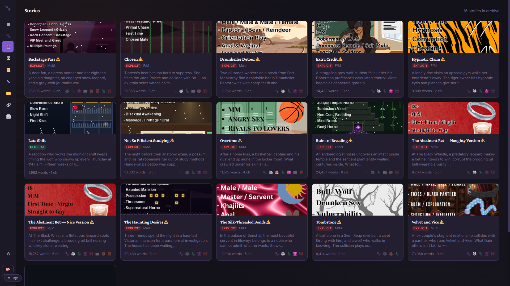
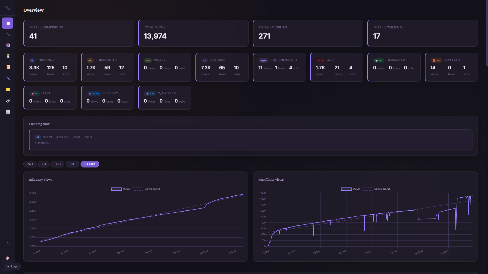
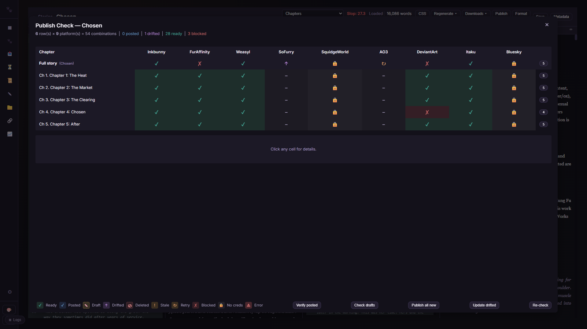
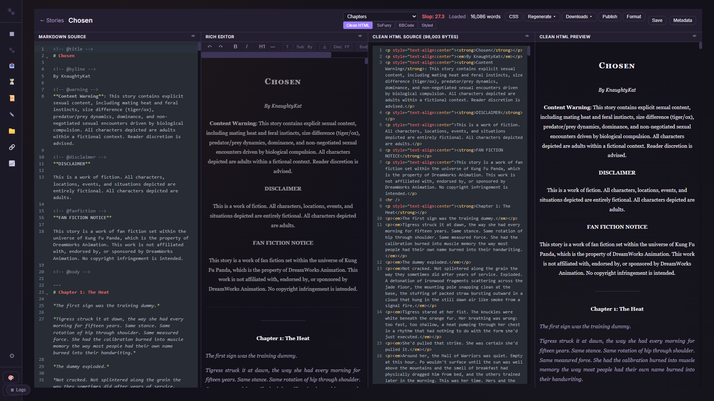

<p align="center">
  
</p>

<h1 align="center">PawPoller</h1>

<p align="center"><strong>Publish your art and fiction everywhere — then see how it did, and fix it in place.</strong></p>

<p align="center">🌐 <a href="https://pawpoller.pages.dev"><strong>pawpoller.pages.dev</strong></a> &nbsp;·&nbsp; features, screenshots, download</p>

<p align="center">
  <a href="LICENSE"></a>
  <a href="https://python.org"></a>
  <a href="#quick-start"></a>
  <a href="#server--docker-deployment"></a>
</p>

PawPoller is a desktop app and self-hosted server for publishing fiction and artwork across furry platforms. Write in Markdown, convert to every format (BBCode, HTML, Styled HTML, PDF), publish to **17 platforms** with per-chapter tags and descriptions, and track views, favourites and comments across **19** from one dashboard. Corrections are made once and pushed back out: PawPoller can **edit an existing post in place on 9 platforms**. Most multi-platform tools stop at the upload. [PostyBirb](https://www.postybirb.com/) reaches more sites than PawPoller does (37 to 20) and is excellent at getting a piece out the door -- but it has no analytics and no way to edit a post once it is live. PawPoller is built around the half that comes after: every view, favourite and comment in one place, and the ability to go back and change what you published.

---

## Features

- **Multi-format conversion** -- Markdown to BBCode (Inkbunny), HTML (SoFurry), Styled HTML (AO3 work skins), PDF, and SquidgeWorld format, all from one source file
- **20-platform reach** -- 19 polled for analytics, 17 published to, 9 editable in place. Galleries (Inkbunny, FurAffinity, SoFurry, Weasyl, DeviantArt, Itaku, e621, Furbooru, FurryNetwork, Instagram, Pixiv), archives (AO3, SquidgeWorld, Wattpad) and microblogs (Bluesky, Mastodon, Tumblr, X/Twitter, Threads, Telegram)
- **Edit once, sync everywhere** -- Change a title, description, tags or rating on the canonical record and push it to every platform that accepts an edit. Platforms that cannot edit are marked post-only rather than silently skipped
- **Chaptered publishing** -- Split multi-chapter stories automatically, with per-chapter tags, descriptions, and thumbnails
- **Scheduling** -- Queue stories, artwork and posts for a future time, with a list or calendar view of everything pending
- **Masterpieces** -- One canonical record per piece of art, with its uploads across every site linked to it (by perceptual hash or by publishing), pooled stats, and labelled variants for alternate renders
- **Collections** -- Bundle related works of any type and roll their stats up together
- **Posts module** -- A microblog hub for short-form updates across Bluesky, Mastodon, Threads, Tumblr, X and Telegram
- **Analytics dashboard** -- Views, favourites, comments and per-platform metrics with historical charts and a configurable widget grid
- **Polling engine** -- Fetches stats on a schedule and detects new comments and favourites
- **Artist credit** -- A structured artist field rendered in each platform's own markup (`:iconname:` on FurAffinity, `[fa]name[/fa]` on Inkbunny, DText on e621) rather than a pasted URL
- **Telegram notifications** -- Alerts for milestones, new comments, and goal completions
- **Built-in editor** -- Markdown editor with live preview, slop scoring, and format conversion
- **Tag database** -- 20,000+ tags (8,700+ for stories, 11,900+ for artwork) with per-platform validation and chapter-level tagging
- **Goal tracking** -- Set targets for views/favourites/comments and track progress
- **Backup and restore** -- Export everything (database, settings, encrypted vault, media) as one archive, and restore it safely
- **Desktop <-> server mirroring** -- Run both and keep them in step, fetching only the files that actually differ
- **Two deployment modes** -- Desktop app (Windows .exe) or headless Docker server
- **Credential vault** -- Optional encrypted credential storage with system keyring integration
- **Dashboard auth** -- Session-based login with bcrypt, TOTP 2FA, Cloudflare Turnstile, and API keys

---

## Screenshots

<p align="center">
  <br>
  <em>Story archive: every completed story with cover art, ratings, relationships, and status</em>
</p>

<p align="center">
  <br>
  <em>Analytics across 19 platforms: views, favourites, and comment trends over time</em>
</p>

<p align="center">
  <br>
  <em>Publish-check matrix: every chapter and platform at a glance (posted / drifted / blocked)</em>
</p>

<p align="center">
  <br>
  <em>Four-pane editor: Markdown source, live preview, and every derived format in sync</em>
</p>

---

## Quick Start

Full walkthrough: [**docs/SETUP.md**](docs/SETUP.md) — covers desktop, Docker self-hosting (including reverse proxy / Cloudflare Tunnel for public access), and running from source.

### Option A: Download the release (Desktop)

Native builds for Windows and Linux — pick whatever fits your machine:

**Windows** (two formats):

- **`PawPoller-Setup-{version}.exe`** (recommended): single-file installer.
  Per-user install by default (no UAC prompt); optional Start Menu /
  desktop shortcuts; optional "Run on Windows startup". Comes with a
  proper uninstaller in **Add or Remove Programs** that offers to keep
  your data folder so reinstalls don't wipe your SQLite DB / settings.
- **`PawPoller-windows-x64.zip`**: portable build. Extract and run
  `PawPoller.exe` from anywhere. No installer artefacts on your system.

**Linux** (single file):

- **`PawPoller-{version}-x86_64.AppImage`**: distro-independent single-file
  build. `chmod +x` and double-click (or run from a terminal). Works
  on Ubuntu 22.04+, Fedora 37+, Debian 12+, Arch — anything with
  glibc 2.35 or newer. Optional autostart via the in-app Settings →
  General toggle (writes a `.desktop` file under `~/.config/autostart/`).
- Need desktop notifications? `sudo apt install libnotify-bin` (or
  your distro's equivalent). The AppImage works without it; you just
  won't see toast pop-ups.

**macOS**: not yet — on the roadmap. Run via Docker for now.

After the first launch, the in-app setup wizard guides you through
connecting your platforms.

### Option B: Run from source

```bash
git clone https://github.com/knaughtykat01-prog/PawPoller.git
cd PawPoller
pip install -r requirements.txt
python main.py
```

### Option C: Docker (headless server)

```bash
git clone https://github.com/knaughtykat01-prog/PawPoller.git
cd PawPoller
cp .env.example .env    # Edit with your credentials — set DASHBOARD_PASSWORD!
# Optional: set PAWPOLLER_ARCHIVE_DIR in .env to your story-archive path
docker compose up -d --build
```

The dashboard binds to `127.0.0.1:8420` by default (loopback only), reachable at `http://localhost:8420` on the host. To reach it from other devices, put it behind a reverse proxy — or set `PAWPOLLER_BIND=0.0.0.0` in `.env`, but only with `DASHBOARD_PASSWORD` set. See [docs/SETUP.md §2.5](docs/SETUP.md#25-exposing-it-to-the-web).

---

## Supported Platforms

**20 platforms — 19 polled, 17 posted to, 9 editable in place.**

"Edit" means PawPoller can push metadata changes to an *existing* post, so a
correction made once in the app can be synced everywhere it was published.

### Galleries and archives

| Platform | Auth | Poll | Post | Edit | Notes |
|----------|------|------|------|------|-------|
| Inkbunny | Username/password | Yes | Yes | Yes | Official API; chaptered stories + art; can also replace the file |
| FurAffinity | Session cookies (a/b) | Yes | Yes | Yes | Scraping (no official API); posts fine from a server with valid cookies; can replace the file |
| SoFurry | Personal Access Token | Yes | Yes | Yes | Official API v1 for writes; login-free JSON for stats (the API exposes none); chaptered |
| Weasyl | API key | Yes | Yes | Yes | Official API; metadata only — Weasyl cannot replace a file |
| AO3 | Username/password | Yes | Yes | Yes | Rails CSRF login; work skins; chaptered |
| SquidgeWorld | Username/password | Yes | Yes | Yes | Scraping; work skins; chaptered |
| DeviantArt | OAuth2 (client id/secret) | Yes | Yes | Yes\* | \*Split across two endpoints — see below |
| Itaku | Account token | Yes | Yes | Yes | Gallery images; tags replace (they are yours, not communal) |
| e621 | Username + API key | Yes | Yes | Yes | Official REST API; **no title field exists**; tags are communal so edits **merge** |
| Furbooru | Username + API key | Yes | -- | -- | Philomena-family; poll-only |
| FurryNetwork | Refresh token | Yes | Yes | -- | The OAuth password grant is behind reCAPTCHA; paste a refresh token |
| Instagram | Meta access token | Yes | Yes | -- | Official Graph API; Business/Creator account |
| Pixiv | Refresh token | Yes | -- | -- | App API; illustrations + novels |
| Wattpad | Public (read-only) | Yes | -- | -- | Public stats only |

### Microblogs (the Posts module)

| Platform | Auth | Poll | Post | Edit | Notes |
|----------|------|------|------|------|-------|
| Bluesky | Handle/app password | Yes | Yes | -- | AT Protocol; posts are immutable (delete + repost) |
| Mastodon | Instance URL + access token | Yes | Yes | -- | Decentralised; favourites/boosts/replies |
| Tumblr | API key + blog | Yes | Yes | -- | v2 API; notes |
| X/Twitter | Auth token/ct0, or X API token | Yes | Yes | -- | Poll via official X API v2 (opt-in) → gallery-dl → GraphQL |
| Threads | Meta access token | Yes | Yes | -- | Official API; needs a Meta app |
| Telegram | Bot token | -- | Yes | -- | Post-only; no analytics to poll |

Editing is **not** implemented for the microblog side — the Posts module
publishes only, even where the platform itself allows edits (Mastodon and
Tumblr both do).

**DeviantArt needs two endpoints, because neither carries the other's fields:**

| Fields | Endpoint | Auth |
|---|---|---|
| title, tags, mature flags, gallery folders, comment setting | `POST /deviation/edit/{id}` | OAuth (`publish`/`stash` scope) |
| description | `POST /_napi/shared_api/deviation/update` | session cookie + CSRF |

The official API exposes no description parameter at all, so the description
leg is best-effort: without a session cookie the title, tags and rating still
sync and the description is reported as unchanged rather than failing the edit.
DeviantArt also stores a description as a structured paragraph document — plain
text with bare newlines renders correctly but cannot be reopened in
DeviantArt's own editor, so descriptions are written as paragraph HTML.

---

## Architecture

PawPoller has two entry points:

- **`main.py`** -- Desktop mode. Runs a pywebview native window with a pystray system tray icon. Per-platform poller threads run in the background. Best for personal use on Windows.
- **`server.py`** -- Headless/server mode. Runs just the FastAPI dashboard and a unified poll orchestrator. Designed for Docker or Linux VPS deployment for 24/7 polling.

Both modes share:
- **`dashboard.py`** -- FastAPI application serving the web UI and API
- **`config.py`** -- Settings, credentials, and path resolution
- **`database/`** -- SQLite database with per-platform schemas
- **`frontend/`** -- Plain HTML/JS/CSS dashboard (no build step, no framework)

Each platform follows a consistent file pattern:
```
clients/{xx}/client.py     -- HTTP client for the platform API
polling/{xx}_poller.py     -- Poll cycle orchestration
database/{xx}_queries.py   -- Database queries
database/{xx}_schema.sql   -- SQL schema
routes/{xx}_api.py         -- Dashboard API endpoints
posting/platforms/{xx}.py  -- Upload/edit logic (where supported)
```

Two paths write to platforms, and they are deliberately separate:

- **`posting/platforms/{xx}.py`** -- galleries and archives. One class per platform
  declaring what it can do (`supports_edit`, `supports_artwork_edit`,
  `supports_file_replace`), so a sync knows what to attempt and what to mark post-only.
- **`posting/post_publisher.py`** -- the microblog path for short-form posts. Publish
  only; it has no edit path.

---

## Development

### No personal data in this repository

**Never commit real personal identifiers.** Not in code, comments, docstrings,
test fixtures, sample data, or commit messages. This is a hard rule, not a
preference — the repository is distributed as a public copy, and anything
committed also lives in git history forever, where deleting it later does not
help.

Never commit:

| | use instead |
|---|---|
| Real names of the maintainer or anyone else | `the operator`, `the owner`, `sam` |
| Account handles other than the `KnaughtyKat` project brand | `SecondFur`, `SecondHandle`, `ThirdFur` |
| Artist names and handles | `Inkwolf`, `Penwright`, `Quillfox` |
| Story, chapter and artwork titles | `Sample Story`, `Second Sample` |
| Real email addresses | `owner@example.com` |
| Live submission URLs and IDs | a fabricated id, or omit it |
| Absolute paths containing a username | a relative or `tmp_path` fixture |

A bug report explains itself without a name attached: describe the symptom, not
who reported it. Personal detail belongs in the private workspace, never here.

**The guard.** `deploy/make_public.py` builds the distributable copy and scans
it, failing the build on anything that leaks:

```bash
python deploy/make_public.py            # build + scan
python deploy/make_public.py --check-only DIR
```

Run it before publishing. If it flags something, genericise the file — or, when
the file is inherently personal (a real tag vocabulary, a live operator script),
add it to `EXCLUDE_FILES` / `EXCLUDE_DIRS` there instead. The exclude lists are
the source of truth for what ships.

### Prerequisites

- Python 3.11+
- pip

### Setup

```bash
git clone https://github.com/knaughtykat01-prog/PawPoller.git
cd PawPoller
pip install -r requirements.txt
cp .env.example .env          # Optional: for env-based credential config
python main.py                # Desktop mode
# or
python server.py              # Headless mode
```

### Server-only dependencies

For Docker/server deployments, use the pinned server requirements:

```bash
pip install -r requirements-server.txt
```

### Building the Windows executable

```bash
pip install pyinstaller
python -m PyInstaller pawpoller.spec --noconfirm
# Output: dist/PawPoller/PawPoller.exe
```

### Running tests

```bash
python -m pytest tests/ -v
```

### Project documentation

[`docs/SETUP.md`](docs/SETUP.md) covers install and architecture. The source is heavily commented — start with `dashboard.py`, then a platform under `clients/{xx}/` with its `polling/{xx}_poller.py`. See [CONTRIBUTING.md](CONTRIBUTING.md) for the per-platform file pattern.

---

## Security

PawPoller holds your login credentials for up to 20 platforms, so credential handling is
treated as the core of the app: secrets are **always** stored in an encrypted vault
(AES-128 + HMAC via Fernet), never in plaintext, with the key held in your OS keystore or an
out-of-band env var on a server ([SETUP §5.1](docs/SETUP.md)).

The app is assessed against the **[OWASP ASVS 5.0](https://owasp.org/www-project-application-security-verification-standard/) Level 2** standard.
The full self-assessment — all 253 L1/L2 requirements adjudicated with evidence, plus an
honest register of known gaps — is published at
**[`docs/security/ASVS_ASSESSMENT.md`](docs/security/ASVS_ASSESSMENT.md)**. It's a
self-assessment (not third-party certified), maintained as a baseline for future changes.

Found a vulnerability? Please open a private security advisory on the GitHub repository rather
than a public issue.

---

## Contributing

See [CONTRIBUTING.md](CONTRIBUTING.md) for guidelines on development setup, adding new platforms, code style, and pull requests.

---

## License

[MIT](LICENSE)

---

## Credits

- Inspired by [PostyBirb](https://www.postybirb.com/) -- PawPoller takes the multi-platform publishing concept and extends it past the upload: pooled analytics, editing a post after it is live, chaptered stories and format conversion
- Built with [FastAPI](https://fastapi.tiangolo.com/), [pywebview](https://pywebview.flowrl.com/), [Chart.js](https://www.chartjs.org/)
