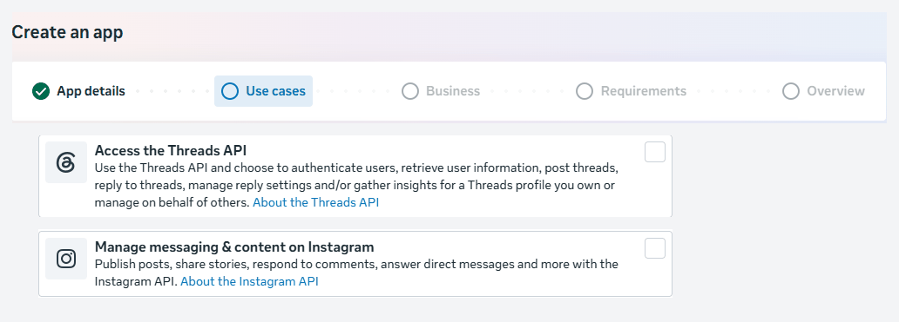
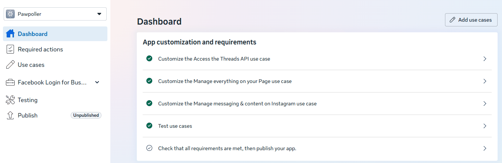
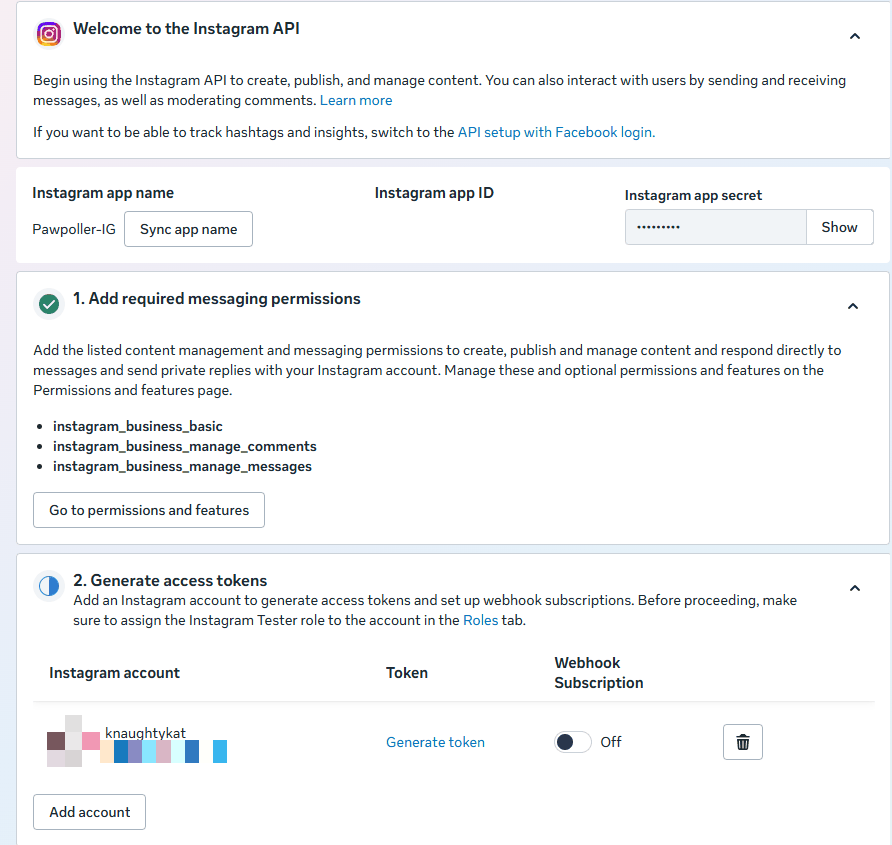
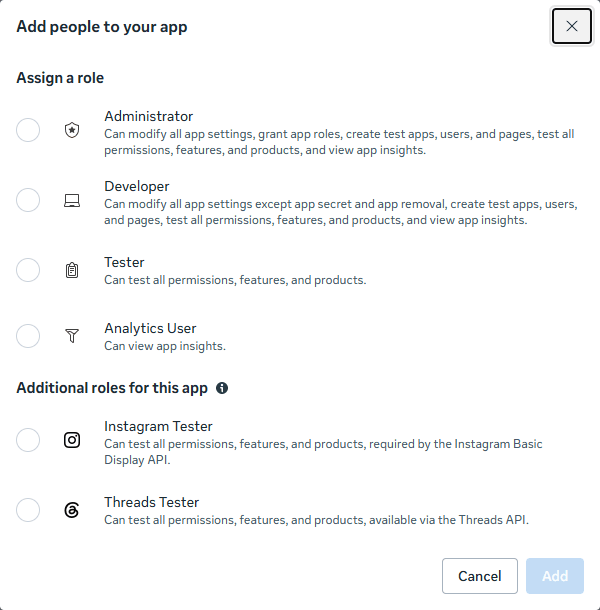
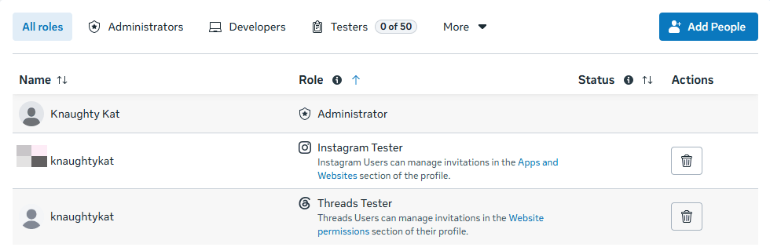
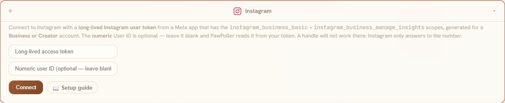

# Instagram setup, step by step

Instagram is the most involved platform PawPoller connects to. Nothing about it is difficult,
but there are roughly six steps that must happen in order, spread across three different places
(the Instagram app, Meta's developer site, and PawPoller), and several of them fail in ways that
do not explain themselves.

Every screenshot below is of the real Meta app PawPoller runs against, with its ids blurred; the
steps are the ones that app was actually set up with, not a reading of Meta's docs.

This guide is the long form. There is a shorter version inside the app — **Settings → Platforms
→ Instagram**, or the **📖 Setup guide** button on the Instagram tile at `#/platforms`.

**Budget about 20 minutes**, and read §0 before you start — two of those points will cost you
the whole attempt if you find them out later.

---

## Contents

- [0. Read this first](#0-read-this-first)
- [1. Switch your Instagram account to professional](#1-switch-your-instagram-account-to-professional)
- [1b. Register as a Meta developer (if you never have)](#1b-register-as-a-meta-developer-if-you-never-have)
- [2. Create a Meta developer app](#2-create-a-meta-developer-app)
- [3. Add the permissions](#3-add-the-permissions)
- [4. Add yourself as a tester](#4-add-yourself-as-a-tester)
- [5. Generate the long-lived token](#5-generate-the-long-lived-token)
- [6. Connect it in PawPoller](#6-connect-it-in-pawpoller)
- [7. If you want to post, not just track](#7-if-you-want-to-post-not-just-track)
- [8. Keeping the token alive](#8-keeping-the-token-alive)
- [9. Troubleshooting](#9-troubleshooting)
- [10. What PawPoller does and does not do with Instagram](#10-what-pawpoller-does-and-does-not-do-with-instagram)

---

## 0. Read this first

Two things decide whether this works, and both are easier to get right at the start than to
discover at step 5.

### ⚠ Do not use Chrome

**Use Microsoft Edge, or Firefox, or anything that is not Chrome.** Chrome reliably breaks
Meta's developer dashboard and its token generator: the flow either silently does nothing or
completes without ever showing you a token. There is no error message. It simply does not work,
and it looks like you did something wrong.

This is not a theory — it is the single most common way this setup fails.

### ⚠ A personal Instagram account cannot be used at all

The API PawPoller uses only exists for **Business** and **Creator** accounts. If your account is
personal, no amount of correct setup elsewhere will help. Step 1 fixes this and takes about
thirty seconds.

### What you will need

| | |
|---|---|
| An Instagram **Business or Creator** account | Free. Step 1. |
| A **Meta developer account** | Free, registered once with an ordinary Facebook account. §1b — including what to do if its registration loops. |
| A **Meta developer app** | Free. Step 2. You do **not** need a Facebook Page. |
| A **long-lived access token** | Free. Step 5. Lasts ~60 days; PawPoller renews it for you. |

### Where each step happens

Everything is done on a **desktop browser** except step 1, which is done in the Instagram
**mobile app**.

---

## 1. Switch your Instagram account to professional

In the **Instagram mobile app**:

1. Go to your profile → **☰ menu** → **Settings and privacy**.
2. Find **Account type and tools** → **Switch to professional account**.
3. Choose **Business** or **Creator**. Either works.

Instagram will ask you to pick a category and may offer to connect a Facebook Page — **you can
skip the Facebook Page**. PawPoller uses the "Instagram API with Instagram Login" flow, which
does not involve Pages at all.

> **Why:** Meta only exposes media insights (views, reach, saves, shares) for professional
> accounts. On a personal account the endpoints exist but return nothing you can use.

---

## 1b. Register as a Meta developer (if you never have)

Step 2 assumes you already have a Meta developer account. Registering is free and happens once —
but the phone-verification step in that registration is genuinely broken for a lot of people, and
has been for years.

**The symptoms**, any of which you may hit:

- You complete the registration and it sends you back to "confirm your phone with a code",
  repeatedly, in a loop.
- No SMS ever arrives, however many times you request one.
- The number you have used for years is suddenly reported as wrong.

This is Meta's, not something you are doing wrong, and it happens entirely before PawPoller is
involved. The good news is that **the two fixes people report most often skip the SMS step
altogether** rather than trying to make it work.

### First: stop requesting codes

**This is counter-intuitive and it matters.** Meta rate-limits verification, and repeated
attempts make things worse rather than better — people report accounts being restricted
specifically for requesting too many codes, and a loop that might have cleared hardening into
"your number is wrong" and then into silence.

If you have already tried three or four times, **stop and leave it alone.** Then work through the
list below, which is ordered by how often each is reported to work and how little it costs you.

### 1. Confirm the number on Facebook itself, not in the developer flow

The most common underlying cause: your Facebook account *has* your number, but it is sitting in a
**"confirmation pending"** state, and the developer registration will not accept an unconfirmed
number.

Confirm it in the ordinary Facebook settings instead:

**Profile picture → Settings and privacy → Settings → Accounts Centre → Personal details →
Contact info.**

Confirm the number there. **The code for this arrives by email, not SMS** — which is exactly why
it works when the SMS route will not. Then return to the developer registration; several people
report the number is simply accepted at that point, with no further verification asked for.

If the number still will not confirm, **adding a different number here first** is also reported
to work.

### 2. Turn off your ad blocker

One detailed report has this as the entire problem: with an ad blocker active, Meta's flow
silently stalls and no code is sent; in a browser without one, the code arrived immediately, on
the same number that had been failing.

This is the real mechanism behind §0's "not Chrome" advice — it is usually less about Chrome
itself than about the extensions loaded in whichever browser you use every day. **A clean browser
profile with no extensions is the thing to try.**

### 3. Add your number to Meta Pay

The most frequently reported fix in the wild: add the same phone number to **Meta Pay**, and the
developer registration stops asking for SMS verification entirely — several people report it then
only asks to confirm their email.

⚠ **Be aware of what some versions of this advice ask for.** A number of people report that what
actually worked for them was adding a **debit or credit card** to Meta Pay, not just a number.
That is a real thing to weigh: handing Meta payment details to work around a broken SMS form is a
meaningful trade, and it is not required for anything PawPoller does. **Try the number-only
version first**, and treat the card as a last resort you may reasonably decide against.

### 4. Wait a day and try again

Unglamorous, and repeatedly reported to work on its own. Several people describe trying for days,
giving up, retrying later in the week, and having it go through first time with nothing changed.
This is also why §"stop requesting codes" matters: you want the rate limit cold when you retry.

### 5. Other things worth ruling out

- **Check the shortcode is not blocked.** Meta sends from **36665** on many networks; if you have
  ever blocked it, or your carrier filters it, no amount of retrying will help.
- **Country code**, particularly if the number was entered with both a country code and a leading
  zero.
- **A number tied to a WhatsApp Business account** is reported to work where a personal number
  did not.
- **Enable two-factor authentication** on the Facebook account, which Meta expects developer
  accounts to have.

### If it will not budge, park Instagram

**Instagram is the only one of the twenty platforms that needs a developer account at all.**
Everything else connects with an ordinary login, an app password, or an API key, in a couple of
minutes each.

Nothing else depends on it. Connect the other nineteen, and come back to Instagram another day
when the rate limit is cold — not while you are annoyed at a verification form.

> **Where this comes from:** §0's Chrome warning and everything from §2 onwards is first-hand.
> This section is assembled from many people reporting the same Meta bug publicly, so treat it as
> a ranked list of things that have worked for others rather than a guaranteed fix. The ordering
> reflects how often each is reported and how little it costs you.

---

## 2. Create a Meta developer app

In a **desktop browser that is not Chrome**, go to **[developers.facebook.com/apps](https://developers.facebook.com/apps)**
and sign in with the Facebook account you want to own this app. It does not need to be connected
to your Instagram account.

1. **Create app**. The wizard has five steps: *App details → Use cases → Business → Requirements →
   Overview*.
2. **App details**: any name (30 characters max); the contact email is pre-filled.
3. **Use cases**: tick **Manage messaging & content on Instagram**. If you also want Threads, tick
   **Access the Threads API** in the same list — one app serves both. (The list has twenty
   entries; the *Content management* filter narrows it.)
4. **Business**: you do not need a business portfolio — skip it. Finish the remaining steps and
   create the app.



Already have an app? Open it and press **Add use cases** on its dashboard instead.

Once the app exists, its dashboard lists the use cases you picked. Meta also adds **Facebook Login
for Business** and a **Manage everything on your Page** use case by itself; PawPoller uses neither,
so leave them alone.



Now open the Instagram use case: **Use cases → Customize** next to *Manage messaging & content on
Instagram* → the left-hand tab **API setup with Instagram login**.



That tab name is the one to steer by. The tab next to it, **API setup with Facebook login**, is a
different flow that needs a Facebook Page, and Meta's welcome box on this page suggests switching
to it "to track hashtags and insights". Ignore that: PawPoller's insights work through Instagram
login for your own posts, and hashtag search is not something PawPoller does.

> **You do not need App Review, and the app stays Unpublished.** While your app is in development
> mode and you are using it with your *own* account, Meta requires no review. The **Publish**
> button stays greyed out until you add a privacy policy URL — you never need to press it. Review
> only becomes relevant if you publish the app for other people — see §10.

---

## 3. Add the permissions

Short version: **you can skip this step.** The **Permissions and features** tab of the use case
lists every Instagram permission with an **Add** button. That table is what App Review looks at.
It does not gate the token you generate for yourself in step 5 — that token asks for all five
scopes PawPoller can use, whatever the table says:

| Scope | Needed for |
|---|---|
| `instagram_business_basic` | Everything. |
| `instagram_business_manage_insights` | Stats — views, reach, saves, shares |
| `instagram_business_content_publish` | **Posting** from PawPoller |
| `instagram_business_manage_comments`, `instagram_business_manage_messages` | Nothing PawPoller does; Meta bundles them into the same request |

The app this guide was written from has never had the insights or publishing scopes "added" in
that table, and stats arrive every poll. Adding them costs nothing if you would rather see them
listed; it does not change the token.

> **What matters is what you approve in step 5.** Permissions are baked into the token at
> generation time. Approve everything the dialog asks for — declining the publishing scope gives
> you a token that polls perfectly and has **every post rejected**, with no hint why until a post
> fails.

Section **1. Add required messaging permissions** on the *API setup* page is Meta's boilerplate
for messaging apps. Ignore it, along with **3. Configure webhooks** (needs a published app) and
**5. Complete app review**.

---

## 4. Add yourself as a tester

Your own Instagram account has to be attached to the app before it will issue a token for it.

1. Left sidebar → **App roles → Roles** → **Add People**.
2. Under *Additional roles for this app* pick **Instagram Tester**, type your Instagram username,
   **Add**.



3. Now **accept the invitation from inside Instagram**: in the Instagram app or on the web, go to
   **Settings → Apps and websites → Tester invites** and accept.



The invitation is easy to miss — Instagram does not notify you about it in any prominent way. If
step 5 does not list your account, this unaccepted invite is the first thing to check. (The Roles
page calls the role "required by the Instagram Basic Display API" — that API is retired; the role
is simply how Meta attaches a test account to an unpublished app.)

---

## 5. Generate the long-lived token

Back on **Use cases → Customize → API setup with Instagram login**, open section
**2. Generate access tokens**.

1. If your account is not listed, press **Add account** and log into Instagram as it.
2. Press **Generate token** on your account's row.
3. Instagram asks you to approve the permissions from §3. **Approve all of them.**
4. Copy the token. It is long — several hundred characters. Copy all of it.

**Copy it somewhere safe before leaving the page.** Meta does not always let you view an existing
token again; if you lose it you generate a new one, which is not a disaster, but it is avoidable.
Leave *Webhook Subscription* off.

> If nothing happens when you click generate, or the token box stays empty: **you are almost
> certainly in Chrome.** See §0.

---

## 6. Connect it in PawPoller

### Desktop or web dashboard

1. **Settings → Platforms → Instagram**.
2. Paste the token into **Access token**.
3. **User ID** is optional — leave it blank and PawPoller uses `me`, which resolves to whichever
   account the token belongs to. Fill it in only if you have a specific reason to pin it.
4. Press **Connect**.



On success the accordion's dot turns green and shows the username the token actually belongs to.
That username is worth reading rather than skimming: it is confirmation that the token is for the
account you think it is.

### Headless / Docker

Set these in `.env` and restart:

```bash
IG_ACCESS_TOKEN=your_long_lived_token_here
# Optional — defaults to "me"
# IG_USER_ID=
```

You can also paste the token through the web dashboard exactly as above; the `.env` route just
saves a step on first deploy.

### Check it worked

Press **IG Poll Now** in the same panel. Your recent posts should appear at `#/ig` within a few
seconds.

---

## 7. If you want to post, not just track

Tracking works the moment step 6 succeeds. **Posting needs one more thing**, and it is the part
of Instagram that surprises people.

### Why there is an extra step

**Instagram never accepts image bytes.** Meta's Content Publishing API takes a public `image_url`
and fetches the picture from that address itself. So PawPoller has to put your image somewhere
Meta can reach before it can post it.

This also means **every Instagram post requires a photo**. There is no text-only Instagram post,
and PawPoller will refuse the attempt rather than fail halfway.

### If PawPoller runs on a server

Set the public base URL of your instance:

```bash
IG_PUBLIC_BASE_URL=https://pawpoller.example.com
```

PawPoller then hosts the image on itself: it converts and downscales the picture to a web-safe
JPEG, serves it at an unguessable one-off URL with a **15-minute lifetime**, hands Meta the URL,
publishes, and deletes the stash afterwards.

The address must be genuinely reachable from the internet — Meta is the one fetching it. A
`localhost` address or a private LAN IP will not work.

### If PawPoller runs on your desktop

The desktop app binds to `localhost`, which Meta cannot reach — so PawPoller finds Meta an address
for you. **There is nothing to set up.** When you post, it tries these in order and uses the first
that works:

1. **Your own server**, if you have paired the desktop with one (Settings → Posting → Server Sync).
2. **The PawPoller relay** — a public PawPoller server hosts the picture at an unguessable link for
   fifteen minutes, then deletes it. On by default.
3. **A temporary tunnel from your PC** — if the relay cannot be reached, a throwaway public link to
   the picture on your own machine, open only for the length of the post. This one needs a small
   helper from Cloudflare (about 55 MB), downloaded once when you press the button under
   **Settings → Posting → Instagram image host**.

That same page shows which of the three applies to you, lets you switch the relay or the tunnel
off, and has a *Test tunnel* button. If every route fails, the post is refused up front with a
sentence that says exactly what was tried, rather than failing partway through.

> **Running your own PawPoller server?** Its Settings → Posting → Instagram image host page has an
> **Open relay** switch. On, it hosts pictures for other people's desktop installs the same way —
> re-encoded to JPEG, fifteen minutes, ten pictures per address per ten minutes, three hundred at
> once — and their app can be pointed at it under the relay's URL.

### What gets posted

- **Caption** — the artwork's description, or its title if there is no description.
- **Hashtags** — your tag set, appended to the caption. Sanitised to letters, digits and
  underscores, deduplicated, and **capped at Instagram's limit of 30**.

---

## 8. Keeping the token alive

Long-lived tokens last about **60 days**, and **PawPoller refreshes yours automatically** while it
polls. In normal use you should never have to think about this.

If it does lapse — the app was off for two months, or the token was revoked — generate a fresh one
(step 5) and paste it in again (step 6). Nothing else needs redoing: your app, permissions and
tester role all stay valid.

---

## 9. Troubleshooting

### "Session expired — re-enter credentials", but the token is new

**Check your Meta app's status before touching the token.** Meta returns an app-level block as
`OAuthException code 200, "API access blocked"`, which is a problem with the *app*, not the
credential. PawPoller distinguishes these:

| What you see | What it means |
|---|---|
| 🔴 **Red — "expired, re-enter credentials"** | Meta code 190. The token genuinely is expired or invalid. Generate a new one. |
| 🟡 **Amber — "couldn't verify"** | An app-level block, a permissions problem, a rate limit, or a network blip. **The token is probably fine.** Check the app's status in the Meta dashboard. |

Unblocking the app is a Meta-side action; PawPoller can only report it honestly.

> **If Threads breaks at the same moment, that is a strong clue.** Threads and Instagram are both
> Meta and are usually configured under the *same* Meta app, so an app-level block takes out both
> simultaneously. Two platforms failing in the same minute points at the app, not at two
> coincidentally expired tokens.

### Posts appear but views, reach, saves and shares are all zero

Meta rejects an entire insights request if any single requested metric is invalid for that media
type. PawPoller degrades gracefully — likes and comments come straight off the media object and
are always captured — but the insight metrics land as zeros for that post.

Also note **`impressions` was deprecated** for media created after **2 July 2024**. PawPoller
tracks **`views`**, its replacement, so older and newer posts are not directly comparable on that
metric.

### The token generator does nothing

Chrome. See §0.

### I cannot even register as a developer — no SMS code, or an endless loop

A long-standing Meta bug, before any of this applies. **The fixes that work usually skip SMS entirely** — confirming the number in ordinary Facebook settings (where the code comes by email) or adding it to Meta Pay. See §1b, and stop requesting codes while you read it.

### It will not issue a token for my account

The tester invitation is unaccepted. See §4 — accept it inside Instagram under
**Settings → Apps and websites → Tester invites**.

### Everything is connected but posting is rejected

The token was generated without `instagram_business_content_publish` — most likely declined in
the approval dialog. Permissions are baked into the token at generation time, so **generate a
new token** (step 5), approve everything it asks for, and paste it in again.

---

## 10. What PawPoller does and does not do with Instagram

**Tracks:** views, reach, likes, comments, saved and shares per post, over time — with the same
dashboard, growth charts, comparisons, CSV export, trend detection and notifications as every
other platform.

**Posts:** yes, both from the Posts module and as a first-class artwork target, so Instagram can
be ticked alongside Inkbunny, FurAffinity, Weasyl and the rest.

**Edits:** no. **Instagram has no photo edit or replace API**, so PawPoller treats it as
post-only. When you push a correction to a piece from a Masterpiece, Instagram is skipped
deliberately and labelled as such, rather than being quietly passed over.

**Insight calls are one-per-post.** Instagram offers no batch insights endpoint, so a large
back-catalogue polls more slowly than platforms that return everything in one call. This is
Instagram's shape, not a PawPoller limitation.

### One honest caveat

Meta gates this API behind app review for any app used by people other than its owner, and its
policies remove adult content. For your own account in development mode none of that applies. But
if you were hoping to hand this setup to other people through a published app, expect review, and
expect adult content to be a problem with Meta specifically.

---

## Related

- [`THREADS_SETUP.md`](THREADS_SETUP.md) — the same app, the Threads use case; ten minutes once
  Instagram is done
- [`SETUP.md` §5](SETUP.md#5-platform-credentials) — credentials for all twenty platforms, and
  what each needs to poll versus to post
- [`SELF_HOSTING.md`](SELF_HOSTING.md) — running PawPoller on a server, which is also what gives
  you the public URL Instagram posting needs
