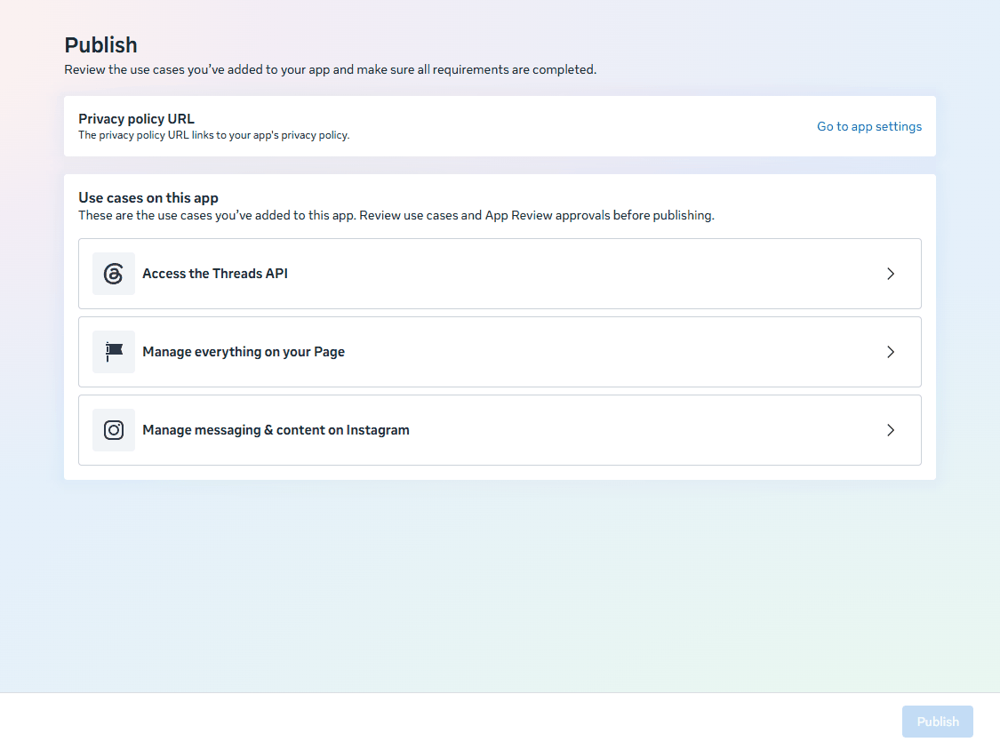
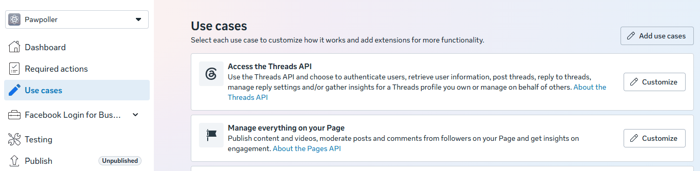
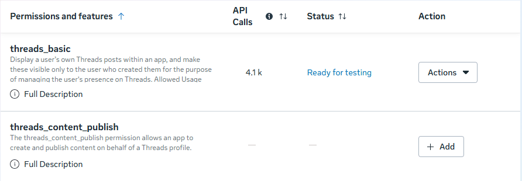
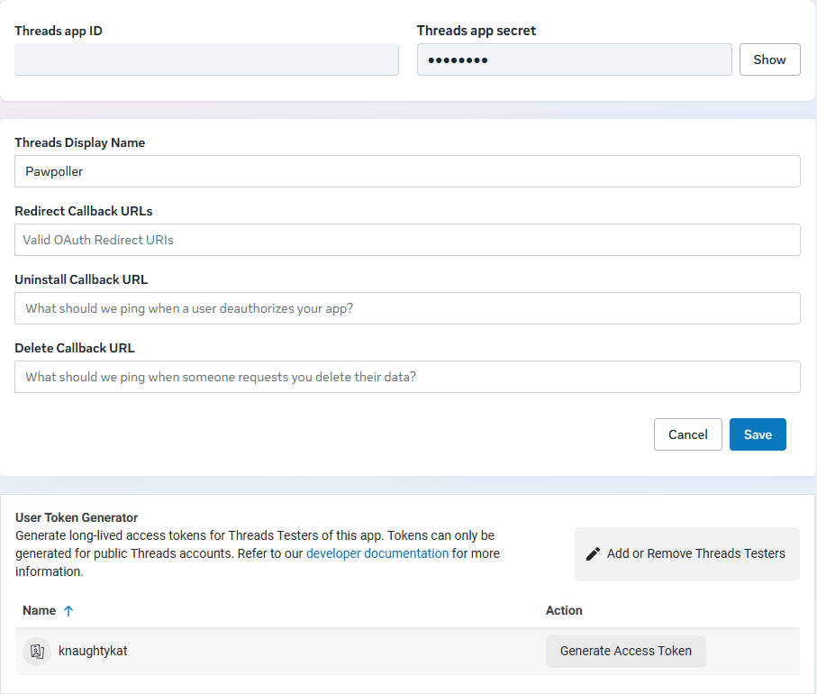
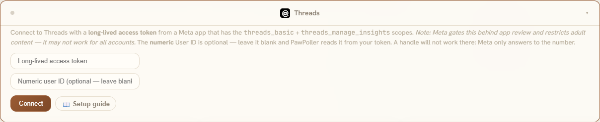

# Threads setup, step by step

Threads is the second of the two Meta platforms PawPoller connects to, and it shares everything
with Instagram: the same developer account, the same app, the same kind of long-lived token. If
you have already set up [Instagram](INSTAGRAM_SETUP.md), Threads is ten minutes on the app you
already have. If you have not, budget twenty minutes and read **§0 of the Instagram guide first**
— the Chrome warning and the developer-registration loop apply here unchanged.

Every screenshot below is of the real Meta app PawPoller runs against, with its ids blurred; the
steps are the ones that app was actually set up with, not a reading of Meta's docs.

The short version is inside the app — **Settings → Platforms → Threads**, or the **📖 Setup
guide** button on the Threads tile at `#/platforms`.

---

## Contents

- [0. Read this first](#0-read-this-first)
- [1. Create (or reuse) the Meta developer app](#1-create-or-reuse-the-meta-developer-app)
- [2. Open the Threads use case](#2-open-the-threads-use-case)
- [3. Add yourself as a Threads Tester](#3-add-yourself-as-a-threads-tester)
- [4. Generate the long-lived token](#4-generate-the-long-lived-token)
- [5. Connect it in PawPoller](#5-connect-it-in-pawpoller)
- [6. Keeping the token alive](#6-keeping-the-token-alive)
- [7. Troubleshooting](#7-troubleshooting)
- [8. What PawPoller does and does not do with Threads](#8-what-pawpoller-does-and-does-not-do-with-threads)

---

## 0. Read this first

### ⚠ Do not use Chrome

**Use Microsoft Edge, or Firefox, or anything that is not Chrome.** Chrome reliably breaks Meta's
developer dashboard and its token generator: the flow either silently does nothing or completes
without ever showing you a token. There is no error message. See
[`INSTAGRAM_SETUP.md` §0](INSTAGRAM_SETUP.md#0-read-this-first) — it also covers what to do when
Meta's developer registration will not send you a verification code.

### Your Threads profile must be public

Meta's token generator says it plainly: *"Tokens can only be generated for public Threads
accounts."* A private profile gets no token. There is no Business/Creator requirement — that is
an Instagram thing — but the profile has to be public.

### What you will need

| | |
|---|---|
| A **public Threads account** | The one you post from. |
| A **Meta developer account** | Free, registered once with an ordinary Facebook account. |
| A **Meta developer app** | Free. §1. The Instagram one, if you have it — one app serves both. |
| A **long-lived access token** | Free. §4. Lasts ~60 days; PawPoller renews it for you. |

Everything is done on a **desktop browser**, except accepting the tester invite, which can be done
in the Threads app.

---

## 1. Create (or reuse) the Meta developer app

**Already set up Instagram?** Open that app at
[developers.facebook.com/apps](https://developers.facebook.com/apps), press **Add use cases** on
its dashboard, tick **Access the Threads API**, and skip to §2.

Otherwise, in a **desktop browser that is not Chrome**, go to
**[developers.facebook.com/apps](https://developers.facebook.com/apps)** and sign in with the
Facebook account you want to own the app. It does not need to be connected to Threads or
Instagram.

1. **Create app**. The wizard has five steps: *App details → Use cases → Business → Requirements →
   Overview*.
2. **App details**: any name (30 characters max); the contact email is pre-filled.
3. **Use cases**: tick **Access the Threads API**. If you also want Instagram, tick **Manage
   messaging & content on Instagram** in the same list.
4. **Business**: you do not need a business portfolio — skip it. Finish the remaining steps and
   create the app.

The new app's dashboard lists the use cases you picked. Meta also adds **Facebook Login for
Business** and a **Manage everything on your Page** use case by itself; PawPoller uses neither,
so leave them alone.

> **You do not need App Review, and the app stays Unpublished.** While your app is in development
> mode and you are using it with your *own* account, Meta requires no review. The **Publish**
> button stays greyed out until you add a privacy policy URL — you never need to press it.

---

## 2. Open the Threads use case

Left sidebar → **Use cases** → **Customize** next to *Access the Threads API*.

The use case has two tabs. **Permissions and features** lists every Threads permission with an
**Add** button; `threads_basic` is already there and marked *Ready for testing*.

**You can leave that table alone.** It is what App Review looks at; it does not gate the token
you generate for yourself in §4. The app this guide was written from has only ever had
`threads_basic` added there, and views, likes, replies, reposts and quotes arrive every poll. If
you would rather see `threads_manage_insights` listed, add it — it costs nothing and changes
nothing.

The **Settings** tab is where the work happens. It shows the Threads app ID and secret (PawPoller
does not need either), a display name, three callback URL fields — **leave all three empty**; they
are for apps that log other people in — and, at the bottom, the **User Token Generator**.

---

## 3. Add yourself as a Threads Tester

Your Threads account has to be attached to the app before the token generator will list it.

1. On the use case's **Settings** tab press **Add or Remove Threads Testers**. (It is the same page
   as **App roles → Roles** in the left sidebar.)
2. **Add People** → under *Additional roles for this app* pick **Threads Tester** → type your
   Threads username → **Add**.

3. Now **accept the invitation from inside Threads**: **Settings → Account → Website permissions**
   → accept the tester invite. (The Roles page words it as "Threads Users can manage invitations
   in the Website permissions section of their profile.")

Until the invite is accepted your name does not appear in the token generator, and there is no
error telling you why.

---

## 4. Generate the long-lived token

Back on the use case's **Settings** tab, scroll to **User Token Generator**. Your username now has
a **Generate Access Token** button.

1. Press **Generate Access Token**.
2. Threads asks you to approve what the app is requesting. Approve it.
3. Copy the token. It is long — well over a hundred characters. Copy all of it.

**Copy it somewhere safe before leaving the page.** If you lose it you generate a new one, which
is not a disaster, but it is avoidable.

> If nothing happens when you click generate, or the token never appears: **you are almost
> certainly in Chrome.** See §0.

---

## 5. Connect it in PawPoller

1. **Settings → Platforms → Threads**.
2. Paste the token into **Access token**.
3. **User ID** is optional — leave it blank and PawPoller resolves it from the token.
4. Press **Connect**.

On success the card's dot turns green and shows the username the token actually belongs to. Read
it rather than skimming it: it is confirmation that the token is for the account you think it is.

Then press **THR Poll Now** in the same card. Your recent posts should appear at `#/thr` within a
few seconds.

---

## 6. Keeping the token alive

Long-lived tokens last about **60 days**, and **PawPoller refreshes yours automatically** while it
polls. In normal use you should never have to think about this.

If it does lapse — the app was off for two months, or the token was revoked — generate a fresh one
(§4) and paste it in again (§5). Nothing else needs redoing: your app, tester role and use case
all stay valid.

---

## 7. Troubleshooting

### My name is not in the User Token Generator

The tester invite is unaccepted (§3 — **Settings → Account → Website permissions** in Threads),
or the profile is private (§0).

### The token generator does nothing

Chrome. See §0.

### "Session expired — re-enter credentials", but the token is new

PawPoller separates two things that look alike:

| What you see | What it means |
|---|---|
| 🔴 **Red — "expired, re-enter credentials"** | Meta code 190. The token genuinely is expired or invalid. Generate a new one. |
| 🟡 **Amber — "couldn't verify"** | An app-level block, a permissions problem, a rate limit, or a network blip. **The token is probably fine.** Check the app in the Meta dashboard. |

> **If Instagram breaks at the same moment, that is a strong clue.** Both live under the same Meta
> app, so an app-level block takes out both at once. Two platforms failing in the same minute
> points at the app, not at two coincidentally expired tokens.

### Views are zero on every post

Meta labels the Threads `views` metric as *"in development"* in its own responses, and it does
return zero for some posts that plainly have views. Likes, replies, reposts and quotes are exact.
This is Meta's shape, not a PawPoller bug.

---

## 8. What PawPoller does and does not do with Threads

**Tracks:** views, likes, replies, reposts and quotes per post, over time — with the same
dashboard, growth charts, comparisons, CSV export, trend detection and notifications as every
other platform.

**Posts:** no. Threads is analytics-only in PawPoller.

**Insight calls are one-per-post.** Threads offers no batch insights endpoint, so a large
back-catalogue polls more slowly than platforms that return everything in one call.

### One honest caveat

Meta gates this API behind App Review for any app used by people other than its owner, and its
policies remove adult content. For your own account in development mode none of that applies.

---

## Related

- [`INSTAGRAM_SETUP.md`](INSTAGRAM_SETUP.md) — the same app, the Instagram use case, and §0's
  notes on Meta's developer registration
- [`SETUP.md` §5](SETUP.md#5-platform-credentials) — credentials for all twenty platforms
